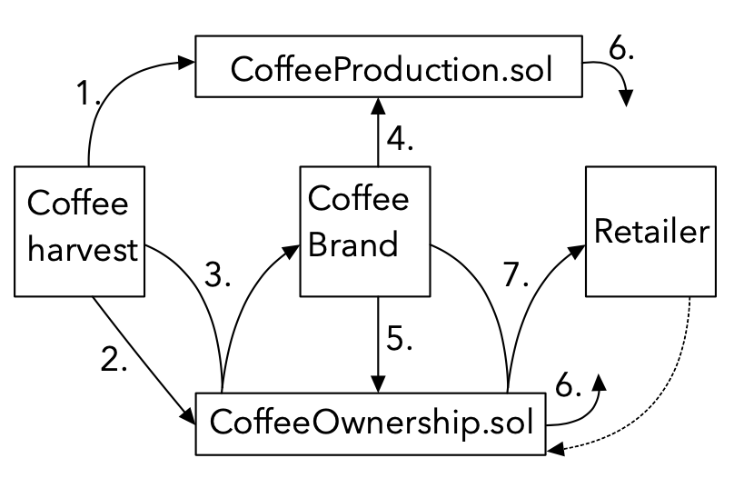

# smart-supply-chain

A PoC demo of a blockchain based supply chain dApp for the overly simplified cycle of coffee harvest, production and distribution by retailers.

## Supply-chain dApp for coffee

### General overview of the simplified product cycle

#### 1. Coffee harvest facility:

Responsible for growing biologically certified coffee, harvesting and roasting it, and preparing sacks for the Coffee Brand manufacturers. Each sack has specific properties.

#### 2. Coffee Brand manufacturer:

Purchases coffee sacks from the Coffee harvest facility and produces consumer-ready coffee products.
Each manufactured product is made up by some combination of sacks from the Coffee harvest facility. A product requires a minimum amount of sacks **n**. For the sake of example, we can use **n=5**.
Similarly to a sack, each product has specific properties.

#### 3. Retailer:

Purchases from the Coffee Brand Manufacturer and sells the consumer-ready products.
The supply chain lifecycle ends here.

### Smart Contracts

There are 2 smart contracts responsible for the supply chain functionality:

1. CoffeeProduction.sol
2. CoffeeOwnership.sol

Interaction with _CoffeeProduction_ takes place during the phases of coffee harvesting and manufacturing. _CoffeeOwnership_ is called whenever a new sack and/or product is created or traded. Furthermore, a verification process that exchanges information between the 2 smart contracts can be used.

### Flow
1. Harvest coffee
2. Set initial owner of harvested sacks
3. Trade coffee (Change owner: Harvest Facility -> Product Manufacturer)
4. Manufacture product
5. Set initial owner of product
6. Retailer can pre-validate
7. Trade product (Change owner: Product Manufacturer -> Retailer)
--- Verify coffee origins at any time

### Potential issues
1. Dependency on the coffee harvest facility to be truthful and use only certified coffee and not, for example, buy coffee beans from some non-certified vendor and then simply pose as if they were harvested as certified beans.
This could potentially be solved by adding an independent certifier who is the sole issuer of valid certificate id numbers, which could be added to the properties of a Sack. Then, the sack harvesting process would include a check if the sack _to-be-harvested_ has a valid and not yet used certificate id number.
However, this process still includes relying on a single physical entity to act truthfully when issuing some sort of physical certification.
Therefore, I consider that the issue will still have the same underlying problem at its core even if an independent certifier was added to the process flow.
2. The process representation is overly simplified and there might be a lot of missing and/or incorrectly presented pieces which could prove essential, but this should serve only as a PoC demo.
